# Design Document — EMT Málaga Map

## Overview

EMT Málaga Map es una aplicación Next.js 15 que muestra en tiempo real la posición de los autobuses de la EMT de Málaga sobre un mapa OpenStreetMap renderizado con MapLibre GL y teselas de OpenFreeMap (sin API key). El usuario selecciona una línea para filtrar los buses visibles, ver el trazado de la ruta, sus paradas y los tiempos de llegada al pulsar cualquier parada. Las posiciones se actualizan automáticamente cada 60 segundos mediante polling.

### Decisiones de diseño clave

- **Sin RSC**: toda la UI es `'use client'`. La única lógica server-side vive en API Routes.
- **Proxy obligatorio**: el cliente nunca llama directamente a `datosabiertos.malaga.eu` ni a `www.emtmalaga.es` (CORS). Las API Routes actúan de intermediario.
- **Sin API key de mapas**: se usa MapLibre GL con teselas públicas de OpenFreeMap (`https://tiles.openfreemap.org/styles/bright`).
- **Separación de capas**: CSV/HTML parsing en `src/shared/utils/` y `src/app/api/`, estado global en Zustand, estado servidor en TanStack Query, UI en componentes de feature.
- **CSV real**: los ficheros del Ayuntamiento usan comas como delimitador y comillas dobles como quoting (formato RFC 4180). El campo `codLinea` en ubicaciones llega como float-string (`"1.0"`); se normaliza a string entero (`"1"`) durante el parseo.
- **Snap a polilínea**: los marcadores de bus y de parada se proyectan sobre el trazado GTFS más cercano antes de renderizarse, para que aparezcan sobre la calzada.

---

## Architecture

### Diagrama de componentes y flujo de datos

```mermaid
graph TD
    subgraph Browser["Navegador (cliente)"]
        Page["page.tsx"]
        LS["LineaSelector"]
        SF["SentidoFilter"]
        MapaEMT["MapaEMT (dynamic, ssr:false)"]
        MCC["MapCameraController"]
        BML["BusMarkersLayer"]
        BM["BusMarker ×N"]
        RL["RutaLinea"]
        PM["ParadaModal"]
        Store["EMTStore (Zustand)"]
        TQ["TanStack Query Cache"]
        HookL["useLineas()"]
        HookU["useUbicaciones(linea)"]
        HookP["useParadas(linea)"]
        HookS["useShapes(linea)"]
        HookLL["useLlegadas(parada)"]
    end

    subgraph Server["Next.js Server (API Routes)"]
        RouteL["GET /api/emt/lineas"]
        RouteU["GET /api/emt/ubicaciones?linea=X"]
        RouteP["GET /api/emt/paradas?linea=X"]
        RouteS["GET /api/emt/shapes?linea=X"]
        RouteLL["GET /api/emt/llegadas?parada=X"]
        Parser["CSV_Parser (shared/utils)"]
    end

    subgraph External["Orígenes externos"]
        EMT_L["lineasyparadas.csv (revalidate:3600)"]
        EMT_U["lineasyubicaciones.csv (no-store)"]
        EMT_Mobile["emtmalaga.es/informacionParada.html"]
        GTFS["data/gtfs/shapes.csv + trips.csv (in-memory 30min)"]
    end

    Page --> LS
    Page --> SF
    Page --> MapaEMT
    MapaEMT --> MCC
    MapaEMT --> BML
    MapaEMT --> RL
    MapaEMT --> PM
    BML --> BM
    Store --> HookU
    Store --> HookP
    HookL --> TQ
    HookU --> TQ
    HookP --> TQ
    HookS --> TQ
    HookLL --> TQ
    TQ --> LS
    TQ --> SF
    TQ --> MapaEMT
    HookL -->|"GET /api/emt/lineas"| RouteL
    HookU -->|"GET /api/emt/ubicaciones?linea=X"| RouteU
    HookP -->|"GET /api/emt/paradas?linea=X"| RouteP
    HookS -->|"GET /api/emt/shapes?linea=X"| RouteS
    HookLL -->|"GET /api/emt/llegadas?parada=X"| RouteLL
    RouteL -->|"revalidate:3600"| EMT_L
    RouteU -->|"no-store"| EMT_U
    RouteP -->|"revalidate:1800"| EMT_L
    RouteLL -->|"no-store"| EMT_Mobile
    RouteLL -->|"fallback Haversine"| EMT_U
    RouteS --> GTFS
    EMT_L -->|CSV text| Parser
    EMT_U -->|CSV text| Parser
```



### Flujo de datos principal

1. `page.tsx` monta `LineaSelector`, `SentidoFilter` en la cabecera y `MapaEMT` (cargado con `next/dynamic + ssr:false`).
2. `LineaSelector` llama a `useLineas()` → TanStack Query → `GET /api/emt/lineas` → CSV_Parser → `LineaEMT[]`.
3. El usuario selecciona una línea → `setLineaSeleccionada(codLinea)` en `EMTStore`; el store también reinicia `sentidosActivos` a `[1, 2]` y limpia `paradaSeleccionada`.
4. `MapaEMT` contiene `BusMarkersLayer` (buses filtrados por sentido + snapped), `RutaLinea` (polilíneas GeoJSON + marcadores de parada) y `MapCameraController` (ajusta el encuadre al bounding box de las paradas).
5. `ParadaModal` se abre cuando el usuario pulsa una parada; llama a `useLlegadas(codParada)` → `GET /api/emt/llegadas?parada=X`.
6. `SentidoFilter` lee `cabeceraIda`/`cabeceraVuelta` de `LineaEMT` y permite activar/desactivar cada sentido vía `toggleSentido`.
7. TanStack Query hace polling de ubicaciones cada 60 s; `BusMarkersLayer` re-renderiza los `BusMarker` con las nuevas posiciones.

---

## Components and Interfaces

### Estructura de ficheros completa

```
src/
├── app/
│   ├── api/
│   │   └── emt/
│   │       ├── constants.ts              # URLs de origen y regex de validación
│   │       ├── lineas/
│   │       │   └── route.ts              # GET /api/emt/lineas
│   │       ├── ubicaciones/
│   │       │   └── route.ts              # GET /api/emt/ubicaciones?linea=X
│   │       ├── paradas/
│   │       │   └── route.ts              # GET /api/emt/paradas?linea=X
│   │       ├── shapes/
│   │       │   └── route.ts              # GET /api/emt/shapes?linea=X
│   │       └── llegadas/
│   │           └── route.ts              # GET /api/emt/llegadas?parada=X
│   ├── layout.tsx                        # Root layout — Providers globales
│   ├── page.tsx                          # Página principal
│   └── globals.css
├── features/
│   └── emt/
│       ├── components/
│       │   ├── LineaSelector.tsx         # Selector de línea (combobox)
│       │   ├── MapaEMT.tsx               # Mapa MapLibre GL con sub-capas
│       │   ├── BusMarker.tsx             # Marcador SVG individual de bus
│       │   ├── RutaLinea.tsx             # Polilínea GeoJSON + marcadores de parada
│       │   ├── ParadaModal.tsx           # Popup MapLibre con llegadas
│       │   ├── SentidoFilter.tsx         # Toggles de sentido (ida/vuelta)
│       │   └── MapCameraController.tsx   # Ajuste automático de cámara
│       ├── hooks/
│       │   ├── useLineas.ts              # TanStack Query — lista de líneas
│       │   ├── useUbicaciones.ts         # TanStack Query — posiciones con polling
│       │   ├── useParadas.ts             # TanStack Query — paradas de la línea
│       │   ├── useShapes.ts              # TanStack Query — trazados GTFS
│       │   └── useLlegadas.ts            # TanStack Query — llegadas a una parada
│       ├── services/
│       │   ├── emtApi.ts                 # Funciones fetch puras
│       │   └── emtQueryKeys.ts           # Query keys centralizadas
│       ├── store/
│       │   └── emtStore.ts               # Zustand slice EMT
│       ├── types/
│       │   └── emt.types.ts              # BusUbicacion, LineaEMT, ParadaEMT, etc.
│       └── utils/
│           ├── lineaColors.ts            # Colores por línea/sentido
│           └── isCircular.ts             # Detección de líneas circulares
├── shared/
│   ├── components/
│   │   ├── LoadingSpinner.tsx
│   │   ├── ErrorMessage.tsx
│   │   └── MapSkeleton.tsx
│   └── utils/
│       ├── csvParser.ts                  # parseUbicacionesCSV, parseLineasCSV, parseParadasCSV
│       ├── formatErrorMessage.ts         # Convierte errores a strings legibles
│       ├── snapToPolyline.ts             # Proyecta un punto sobre una polilínea
│       └── catmullRomSmooth.ts           # Suavizado Catmull-Rom de coordenadas
└── providers/
    └── Providers.tsx                     # QueryClientProvider
```

### Interfaces de componentes

```tsx
// BusMarker — recibe zoom para escalar el SVG
interface BusMarkerProps {
  bus: BusUbicacion
  zoom: number
}

// RutaLinea — recibe zoom para el thinning de paradas y tamaño de iconos
interface RutaLineaProps {
  zoom: number
}

// MapaEMT — sin props externas; lee todo del store y de los hooks internos
// BusMarkersLayer — sub-componente interno de MapaEMT, no exportado
// MapCameraController — sin props; renderiza null, solo produce efectos de cámara
// SentidoFilter, LineaSelector, ParadaModal — sin props
```

---

## Data Models

### Tipos TypeScript principales

```typescript
// src/features/emt/types/emt.types.ts

export interface BusUbicacion {
  codBus: string        // Identificador del vehículo
  codLinea: string      // Código de línea normalizado (ej: "1", no "1.0")
  sentido: number       // 1 = vuelta, 2 = ida
  longitud: number      // Coordenada X — rango [-180, 180]
  latitud: number       // Coordenada Y — rango [-90, 90]
  codParIni: string     // Código de parada de inicio de tramo
  lastUpdate: string    // Timestamp ISO de última actualización
}

export interface LineaEMT {
  codLinea: string      // Código único de línea (ej: "1")
  nombreLinea: string   // Nombre descriptivo
  cabeceraIda?: string  // Destino del sentido ida
  cabeceraVuelta?: string
}

export interface ParadaEMT {
  codLinea: string      // Código de la línea normalizado
  codParada: string     // Código identificador de la parada
  nombreParada: string
  sentido: number       // 1 = vuelta, 2 = ida
  orden: number         // Posición en la secuencia del recorrido
  longitud: number
  latitud: number
}

export interface LlegadaLinea {
  codLinea: string
  nombreLinea: string
  sentido: number
  destino: string       // Cabeceravuelta o cabeceraIda según sentido
  proximoBus: {
    codBus: string
    minutos: number
  }
}

export interface ShapePoint {
  latitud: number
  longitud: number
  sequence: number
}

export type ShapesByDirection = Record<number, ShapePoint[]>  // clave: sentido (1|2)

export interface ApiError {
  error: string
}
```

### Normalización de `codLinea`

El CSV de ubicaciones publica `codLinea` como float-string (`"1.0"`, `"10.0"`). El CSV de paradas lo publica como `codLineaStr` (`"1"`, `"10"`). El parser de ubicaciones normaliza el valor:

```typescript
// "1.0" → "1", "10.0" → "10", "C1.0" → "C1"
function normalizeCodLinea(raw: string): string {
  return raw.trim().replace(/\.0$/, '')
}
```

---

## API Routes Design

### Constantes compartidas

```typescript
// src/app/api/emt/constants.ts
export const EMT_UBICACIONES_URL =
  'https://datosabiertos.malaga.eu/recursos/transporte/EMT/EMTlineasUbicaciones/lineasyubicaciones.csv'

export const EMT_LINEAS_URL =
  'https://datosabiertos.malaga.eu/recursos/transporte/EMT/EMTLineasYParadas/lineasyparadas.csv'

export const LINEA_PARAM_REGEX = /^[a-zA-Z0-9-]+$/
export const PARADA_PARAM_REGEX = /^[a-zA-Z0-9-]+$/
```

### GET /api/emt/lineas

Fetches `EMT_LINEAS_URL` con `next: { revalidate: 3600 }`, parsea el CSV con `parseLineasCSV`, ordena por `codLinea` lexicográficamente y devuelve `LineaEMT[]`. Los campos `cabeceraIda` y `cabeceraVuelta` se incluyen en el objeto para que `SentidoFilter` pueda mostrar las etiquetas de cada sentido.

### GET /api/emt/ubicaciones?linea={codLinea}

Fetches `EMT_UBICACIONES_URL` con `cache: 'no-store'`, parsea y filtra `b.codLinea === linea`. Devuelve `BusUbicacion[]`. Valida que `linea` esté presente y coincida con `LINEA_PARAM_REGEX` (HTTP 400 si no).

### GET /api/emt/paradas?linea={codLinea}

Fetches `EMT_LINEAS_URL` con `next: { revalidate: 1800 }`, parsea el CSV con `parseParadasCSV`, filtra por `codLinea` y ordena ascendente por `sentido` → `orden`. Devuelve `ParadaEMT[]`.

### GET /api/emt/shapes?linea={codLinea}

Lee los GTFS locales (`data/gtfs/shapes.csv`, `data/gtfs/trips.csv`) con un caché en memoria de 1800 s. Cruza `trips.csv` para encontrar el `shape_id` por sentido, luego extrae las coordenadas ordenadas de `shapes.csv`. Devuelve `ShapesByDirection` (`{}` si no hay shapes para la línea).

### GET /api/emt/llegadas?parada={codParada}

Intenta obtener llegadas del scraping de `EMT_Mobile` (`informacionParada.html?codParada=X`) con `cache: 'no-store'`. Si falla o no hay datos, cae en fallback Haversine: descarga `EMT_LINEAS_URL` (revalidate:1800) y `EMT_UBICACIONES_URL` (no-store) en paralelo con `Promise.all`, calcula distancia al bus más cercano en ruta usando `busIdx > targetIdx` y velocidad constante de 200 m/min. Devuelve `LlegadaLinea[]` ordenado por `minutos` ascendente.

---

## CSV Parser Design

### Formato real de los CSV

**lineasyubicaciones.csv** — delimitado por comas, con comillas dobles (RFC 4180):
```
"codBus","codLinea","sentido","lon","lat","codParIni","last_update"
"581","1.0","2","-4.456579","36.697693","1253","2026-05-25 19:45:06"
```

**lineasyparadas.csv** — delimitado por comas, con comillas dobles (RFC 4180):
```
"codLinea","codLineaStr","codLineaStrSin","userCodLinea","nombreLinea","observaciones",
"cabeceraIda","cabeceraVuelta",...,"sentido","orden",...,"codParada","nombreParada","lon","lat",...
```

El parser detecta automáticamente el delimitador (coma vs punto y coma) inspeccionando la primera línea, para ser robusto ante cambios del origen.

---

## Zustand Store Design

```typescript
// src/features/emt/store/emtStore.ts

interface ParadaSeleccionada {
  codParada: string
  nombreParada: string
  latitud: number
  longitud: number
  sentido: number
}

interface EMTState {
  lineaSeleccionada: string | null
  sentidosActivos: number[]           // [1, 2] por defecto; nunca vacío
  paradaSeleccionada: ParadaSeleccionada | null
}

interface EMTActions {
  setLineaSeleccionada: (linea: string | null) => void
  toggleSentido: (sentido: number) => void
  setParadaSeleccionada: (parada: ParadaSeleccionada | null) => void
}
```

**Invariante de `sentidosActivos`**: `toggleSentido` nunca deja el array vacío. Si el usuario intenta desactivar el único sentido activo, el toggle mantiene ese sentido activo.

**Efecto de `setLineaSeleccionada`**: resetea `sentidosActivos` a `[1, 2]` y limpia `paradaSeleccionada` en la misma transacción.

**Selectores granulares** (usar siempre en lugar de desestructurar el store):

```typescript
export const selectLineaSeleccionada     = (s) => s.lineaSeleccionada
export const selectSetLineaSeleccionada  = (s) => s.setLineaSeleccionada
export const selectSentidosActivos       = (s) => s.sentidosActivos
export const selectToggleSentido         = (s) => s.toggleSentido
export const selectParadaSeleccionada    = (s) => s.paradaSeleccionada
export const selectSetParadaSeleccionada = (s) => s.setParadaSeleccionada
```

---

## TanStack Query Hooks Design

### Query Keys

```typescript
// src/features/emt/services/emtQueryKeys.ts
export const emtKeys = {
  all:        ['emt'] as const,
  lineas:     () => ['emt', 'lineas'] as const,
  ubicaciones: (linea: string) => ['emt', 'ubicaciones', linea] as const,
  paradas:    (linea: string) => ['emt', 'paradas', linea] as const,
  llegadas:   (parada: string) => ['emt', 'llegadas', parada] as const,
  shapes:     (linea: string) => ['emt', 'shapes', linea] as const,
} as const
```

### Configuración de staleTime por tipo de dato

| Hook | `staleTime` | `refetchInterval` | Justificación |
|---|---|---|---|
| `useLineas` | 55 000 ms | — | Datos estáticos; revalidate:3600 en servidor |
| `useUbicaciones` | 55 000 ms | 60 000 ms | Polling de posiciones en tiempo real |
| `useParadas` | 3 600 000 ms | — | Las paradas cambian raramente |
| `useShapes` | 1 800 000 ms | — | Los trazados GTFS cambian raramente |
| `useLlegadas` | 0 ms | — | Siempre fresco; se dispara al abrir la modal |

**Decisión de diseño**: cuando `linea` o `parada` es `null`, `enabled: false` desactiva la query. Al cambiar de línea, TanStack Query crea nuevas entradas en caché con nuevas query keys, cancelando el polling de la anterior automáticamente.

---

## Components Design

### page.tsx

```tsx
'use client'

// MapaEMT cargado con ssr:false — MapLibre GL requiere APIs de browser
const MapaEMT = dynamic(
  () => import('@/features/emt/components/MapaEMT').then(m => m.MapaEMT),
  { loading: () => <MapSkeleton />, ssr: false },
)

export default function HomePage() {
  return (
    <main className="flex h-screen flex-col">
      <header className="flex items-center gap-4 border-b ...">
        <h1>EMT Málaga</h1>
        <LineaSelector />
        <SentidoFilter />
      </header>
      <div className="flex-1">
        <MapaEMT />
      </div>
    </main>
  )
}
```

### MapaEMT

Componente raíz del mapa. Responsabilidades:

1. Renderiza el `<Map>` de `react-map-gl/maplibre` con estilo OpenFreeMap.
2. En el callback `onLoad` aplica customizaciones de estilo: oculta edificios 3D, filtra POIs turísticos/recreativos, ajusta colores de carreteras a blancos, añade capas de parques y edificios religiosos.
3. Rastrea el zoom actual con `onZoom` para pasarlo a `BusMarkersLayer` y `RutaLinea`.
4. Delega en sub-componentes internos: `<MapCameraController />`, `<RutaLinea zoom={zoom} />`, `<BusMarkersLayer zoom={zoom} />`, `<ParadaModal />`.
5. Superpone indicadores de `isLoading`, `isStale` e `isError` sobre el mapa.

**BusMarkersLayer** (sub-componente interno, no exportado): filtra los buses por `sentidosActivos`, aplica `snapToPolyline` a cada bus usando el shape del sentido correspondiente, y renderiza un `<BusMarker>` por bus.

### BusMarker

Renderiza un `<Marker>` de `react-map-gl/maplibre` con un SVG circular. El color de relleno viene de `getSentidoColor(codLinea, sentido)` (un color diferente por cada combinación línea/sentido). El radio del círculo escala con el zoom:

| zoom | tamaño (px) |
|---|---|
| ≥ 16 | 32 |
| ≥ 15 | 26 |
| ≥ 14 | 20 |
| ≥ 13 | 16 |
| < 13 | 12 |

El texto del círculo es el código de línea abreviado (p. ej. `"C1"` para líneas circulares).

### RutaLinea

Responsabilidades:

1. Lee `paradas` de `useParadas(linea)` y `shapes` de `useShapes(linea)`.
2. Para cada sentido activo: construye la polilínea de coordenadas (shapes si están disponibles, fallback a coordenadas de paradas), aplica suavizado Catmull-Rom (`catmullRomSmooth`) con factor 4 (shapes) o 8 (fallback), y la renderiza como `<Source>/<Layer>` GeoJSON en MapLibre.
3. Aplica thinning de paradas (`thinParadas`) para suprimir marcadores intermedios cuando dos paradas adyacentes quedan a menos de 28 px de pantalla, preservando siempre la primera y la última.
4. Para cada parada visible: aplica `snapToPolyline` si hay shapes, renderiza un `<Marker>` SVG con un círculo blanco bordeado con el color del sentido; al pulsar llama a `setParadaSeleccionada`.

### ParadaModal

Renderiza un `<Popup>` de MapLibre (`closeOnClick: false`) anclado a las coordenadas de `paradaSeleccionada`. Llama a `useLlegadas(codParada)` y muestra:

- Spinner mientras carga.
- Lista de `LlegadaLinea` agrupada: primero las entradas de la línea actualmente seleccionada (badge coloreado + destino + minutos), luego las del resto de líneas separadas por un divisor.
- "No hay buses en camino" si el array está vacío.
- Para líneas circulares sin `destino`, muestra `"Circular {codLinea}"` como fallback.
- Cierra y llama a `setParadaSeleccionada(null)` al pulsar la X.

### SentidoFilter

Solo se renderiza cuando hay una línea seleccionada, la línea no es circular (`isCircular(nombreLinea)`) y ambas cabeceras (`cabeceraIda`, `cabeceraVuelta`) son no vacías. Muestra dos filas (`SentidoRow`) con un toggle switch coloreado por sentido. Llama a `toggleSentido(sentido)` del store.

### MapCameraController

Componente sin DOM (`return null`). Usa `useMap()` de `react-map-gl/maplibre` para acceder al mapa. Cada vez que cambia `linea` o `paradas`, calcula el bounding box de todas las paradas y llama a `map.fitBounds(bounds, { padding: 40 })`.

---

## Shared Utilities

### snapToPolyline

```typescript
// src/shared/utils/snapToPolyline.ts
// Proyecta (lat, lng) sobre el segmento más cercano de una polilínea de ShapePoints.
// Devuelve { lat, lng } del punto proyectado.
export function snapToPolyline(
  lat: number, lng: number,
  shape: ShapePoint[]
): { lat: number; lng: number }
```

### catmullRomSmooth

```typescript
// src/shared/utils/catmullRomSmooth.ts
// Interpola una serie de puntos con la curva Catmull-Rom.
// factor controla el número de puntos interpolados por segmento.
export function catmullRomSmooth(
  points: Array<{ lat: number; lng: number }>,
  factor: number
): Array<{ lat: number; lng: number }>
```

### lineaColors

```typescript
// src/features/emt/utils/lineaColors.ts

// Color base de la línea (mismo para ambos sentidos en la mayoría de líneas)
export function getLineaColor(codLinea: string): string

// Color diferenciado por sentido (ligeramente más oscuro para sentido 1)
export function getSentidoColor(codLinea: string, sentido: number): string

// Color de texto legible sobre un fondo dado (blanco o negro)
export function getTextColor(bgColor: string): string

// Text-shadow para contraste sobre fondo claro/oscuro
export function getTextShadow(textColor: string): string

// Etiqueta corta del código de línea para el SVG del bus
export function getLineaLabel(codLinea: string): string
```

---

## Correctness Properties

### Property 1: El parser de ubicaciones produce objetos con forma y rangos válidos

Para cualquier CSV de ubicaciones con N filas de datos válidas, `parseUbicacionesCSV` debe devolver exactamente N objetos `BusUbicacion`, cada uno con `codLinea` no vacío, `latitud` en `[-90, 90]` y `longitud` en `[-180, 180]`.

**Validates: Requirements 2.5, 3.1**

### Property 2: El parser de líneas produce objetos con forma válida y sin duplicados

Para cualquier CSV de líneas con M filas de datos válidas (potencialmente con líneas repetidas), `parseLineasCSV` debe devolver un array de `LineaEMT` donde cada objeto tiene `codLinea` y `nombreLinea` no vacíos, y no hay dos objetos con el mismo `codLinea`.

**Validates: Requirements 1.3, 3.2**

### Property 3: El parser descarta filas inválidas y preserva las válidas

Para cualquier CSV con mezcla de filas válidas e inválidas (columnas incorrectas, valores numéricos no finitos, campos requeridos vacíos, coordenadas fuera de rango), el parser debe devolver exactamente las filas válidas sin lanzar excepciones.

**Validates: Requirements 3.3, 3.5, 3.6**

### Property 4: El parser recorta espacios en blanco de todos los campos string

Para cualquier CSV donde los campos string tengan espacios en blanco al inicio o al final, el parser devuelve objetos con todos los campos string recortados (`trim()`).

**Validates: Requirements 3.4**

### Property 5: La lista de líneas está ordenada lexicográficamente por codLinea

Para cualquier CSV de líneas válido (independientemente del orden de las filas), `GET /api/emt/lineas` devuelve un array donde `codLinea[i] <= codLinea[i+1]` para todo `i`.

**Validates: Requirements 1.6**

### Property 6: El filtrado de ubicaciones devuelve solo buses de la línea solicitada

Para cualquier conjunto de buses con `codLinea` variados y cualquier código de línea válido `L`, `GET /api/emt/ubicaciones?linea=L` devuelve únicamente buses cuyo `codLinea === L`; si ninguno coincide, devuelve un array vacío.

**Validates: Requirements 2.1, 2.6**

### Property 7: Los errores HTTP del origen se propagan con el mismo status code

Para cualquier código de estado HTTP no-2xx `S` devuelto por `EMT_Origin`, las API Routes devuelven una respuesta con exactamente el mismo status code `S` y un campo `error` con una cadena no vacía.

**Validates: Requirements 1.4, 2.7**

### Property 8: El parámetro linea con caracteres inválidos devuelve 400

Para cualquier string con al menos un carácter no alfanumérico ni guión, `GET /api/emt/ubicaciones?linea={string}` devuelve HTTP 400 con un campo `error` no vacío.

**Validates: Requirements 2.3**

### Property 9: MapaEMT renderiza exactamente un BusMarker por bus activo

Para cualquier array de `BusUbicacion` con coordenadas válidas, `BusMarkersLayer` renderiza exactamente `buses.filter(b => sentidosActivos.includes(b.sentido)).length` marcadores.

**Validates: Requirements 6.1, 6.8**

### Property 10: LineaSelector muestra todas las líneas como opciones seleccionables

Para cualquier array de `LineaEMT` no vacío, `LineaSelector` renderiza exactamente `lineas.length` opciones, cada una mostrando el `codLinea` y `nombreLinea` correspondientes.

**Validates: Requirements 4.3**

### Property 11: El store refleja siempre la última línea seleccionada

Para cualquier secuencia de selecciones, `EMTStore.lineaSeleccionada` es igual al `codLinea` de la última selección; y `sentidosActivos` siempre es `[1, 2]` inmediatamente después de cada cambio de línea.

**Validates: Requirements 5.1, 5.3, 15.3**

### Property 12: Los mensajes de error son siempre cadenas legibles sin datos técnicos

Para cualquier error (instancia de `Error`, objeto arbitrario, o `null`), `formatErrorMessage` devuelve una cadena no vacía que no contiene stack traces, códigos de estado HTTP crudos ni representaciones JSON de objetos de error.

**Validates: Requirements 9.6**

### Property 13: sentidosActivos nunca queda vacío

Para cualquier secuencia de llamadas a `toggleSentido`, `EMTStore.sentidosActivos` siempre contiene al menos un elemento.

**Validates: Requirements 15.2**

---

## Error Handling

### Estrategia de errores por capa

| Capa | Tipo de error | Respuesta |
|---|---|---|
| API Route — origen no-2xx | `res.ok === false` | Propagar mismo status + `{ error: string }` |
| API Route — red/timeout | `fetch` lanza excepción | HTTP 500 + `{ error: string }` |
| API Route — parámetro inválido | Validación manual | HTTP 400 + `{ error: string }` |
| TanStack Query — fetch falla | `Error` lanzado en `queryFn` | `isError: true`, `error: Error` en el hook |
| MapaEMT — polling falla | `isError: true` + `data` previo | Mantiene BusMarkers, muestra banner de error |

### Comportamiento ante errores de polling (Req. 7.6)

Cuando un refetch en background falla, TanStack Query mantiene `data` con el último valor exitoso y pone `isError: true`. `MapaEMT` usa esta combinación para mantener los `BusMarker` existentes y mostrar un indicador de error superpuesto sin ocultar el mapa.

```typescript
// Patrón en BusMarkersLayer / MapaEMT
const { data: rawBuses = [], isError, isStale } = useUbicaciones(linea)
// rawBuses siempre tiene el último valor exitoso gracias al caché de TanStack Query
```

---

## Testing Strategy

### Herramientas

- **Vitest** — runner de tests
- **React Testing Library** — tests de componentes
- **MSW (Mock Service Worker)** — mocks de API HTTP
- **fast-check** — property-based testing

### Distribución de tests por tipo

#### Property-Based Tests (fast-check)

Los parsers CSV son funciones puras con espacio de entrada grande. Son el candidato ideal para PBT.

**Tests PBT a implementar** (uno por propiedad de corrección):

| Test | Propiedad | Archivo |
|---|---|---|
| Parser ubicaciones — forma y rangos | Property 1 | `csvParser.test.ts` |
| Parser líneas — forma y deduplicación | Property 2 | `csvParser.test.ts` |
| Parser — robustez ante filas inválidas | Property 3 | `csvParser.test.ts` |
| Parser — trim de espacios | Property 4 | `csvParser.test.ts` |
| Ordenación de líneas | Property 5 | `lineas/route.test.ts` |
| Filtrado de ubicaciones | Property 6 | `ubicaciones/route.test.ts` |
| Propagación de errores HTTP | Property 7 | `lineas/route.test.ts`, `ubicaciones/route.test.ts` |
| Validación parámetro linea inválido | Property 8 | `ubicaciones/route.test.ts` |
| sentidosActivos nunca vacío | Property 13 | `emtStore.test.ts` |
| formatErrorMessage — sin datos técnicos | Property 12 | `formatErrorMessage.test.ts` |

Configuración: mínimo 200 iteraciones por test PBT (`numRuns: 200`).

#### Unit Tests (Vitest) — lógica pura

```
src/shared/utils/csvParser.test.ts           — edge cases: CSV vacío, solo cabecera, BOM
src/shared/utils/formatErrorMessage.test.ts  — ejemplos concretos de errores
src/shared/utils/snapToPolyline.test.ts      — casos límite de proyección
src/shared/utils/catmullRomSmooth.test.ts    — arrays de 0, 1, 2 puntos
src/features/emt/store/emtStore.test.ts      — acciones, invariante sentidosActivos
src/features/emt/services/emtApi.test.ts     — fetchLineas, fetchUbicaciones con MSW
```

#### Component Tests (RTL + MSW) — comportamiento de UI

```
src/features/emt/components/LineaSelector.test.tsx
  - Muestra spinner mientras carga (Req. 4.2)
  - Muestra opciones cuando carga completa (Req. 4.3) — Property 10
  - Muestra error + retry cuando falla (Req. 4.4, 9.2)
  - Muestra empty state con 0 líneas (Req. 4.6)
  - Llama a setLineaSeleccionada al seleccionar (Req. 5.1)

src/features/emt/components/MapaEMT.test.tsx
  - No renderiza BusMarkers sin línea seleccionada (Req. 5.4)
  - Renderiza N BusMarkers para N buses del sentido activo (Req. 6.1, 6.8)
  - Muestra loading overlay sin quitar marcadores (Req. 6.3)
  - Muestra error sin quitar marcadores (Req. 6.4, 9.3)
  - Muestra empty state con 0 buses (Req. 6.7)
  - Muestra staleness indicator tras error de polling (Req. 7.6)

src/features/emt/components/SentidoFilter.test.tsx
  - No renderiza sin línea seleccionada (Req. 15.6)
  - No renderiza para líneas circulares (Req. 15.4)
  - Toggle llama a toggleSentido del store (Req. 15.2)

src/features/emt/components/ParadaModal.test.tsx
  - No renderiza sin paradaSeleccionada (Req. 14.1)
  - Muestra spinner mientras carga llegadas (Req. 14.3)
  - Muestra "No hay buses en camino" con array vacío (Req. 14.6)
  - Cierra al pulsar X (Req. 14.7)
```

### Cobertura objetivo

| Módulo | Cobertura mínima |
|---|---|
| `src/shared/utils/csvParser.ts` | 95% |
| `src/shared/utils/formatErrorMessage.ts` | 100% |
| `src/shared/utils/snapToPolyline.ts` | 85% |
| `src/features/emt/store/emtStore.ts` | 90% |
| `src/features/emt/services/emtApi.ts` | 85% |
| `src/features/emt/hooks/` | 80% |
| `src/features/emt/components/` | 75% |
| `src/app/api/emt/` | 80% |

---

## Performance Considerations

### Bundle — carga diferida de MapLibre GL

```tsx
// page.tsx — MapaEMT cargado solo en cliente, con skeleton durante la carga
const MapaEMT = dynamic(
  () => import('@/features/emt/components/MapaEMT').then(m => m.MapaEMT),
  { loading: () => <MapSkeleton />, ssr: false },
)
```

`maplibre-gl` y `react-map-gl` son pesados. Con `next/dynamic + ssr: false` se excluyen del bundle inicial y se cargan solo cuando el componente se monta en el cliente. No requieren API key externa.

### Re-renders — selectores granulares de Zustand

`MapaEMT`, `BusMarkersLayer`, `RutaLinea`, `SentidoFilter` y `ParadaModal` suscriben únicamente al slice del store que necesitan. Cambios en `sentidosActivos` no provocan re-renders en componentes que solo leen `lineaSeleccionada`.

### Re-renders — BusMarker estable

Los `BusMarker` se identifican por `key={bus.codBus}`. React reconcilia por key y solo re-monta los marcadores que realmente cambian de posición entre polls.

### Re-renders — thinning de paradas

`thinParadas` calcula proyecciones Mercator para suprimir marcadores de parada que quedarían a menos de 28 px entre sí al zoom actual. Esto evita renderizar cientos de `<Marker>` innecesarios en zooms bajos.

### Async — fetches paralelos

`GET /api/emt/llegadas` usa `Promise.all` para descargar en paralelo el CSV de líneas y el de ubicaciones cuando aplica el fallback Haversine. Futuras API Routes que combinen varios orígenes deben seguir el mismo patrón.

### Polling — eficiencia de TanStack Query

- `staleTime: 55_000` en `useUbicaciones` evita refetches redundantes si el componente se desmonta y remonta dentro de la ventana de 55 s.
- `refetchOnWindowFocus: true` (default) garantiza un refetch inmediato al volver al tab.
- Al cambiar de línea, TanStack Query cancela el polling de la línea anterior automáticamente al cambiar la query key.
- `useParadas` y `useShapes` tienen `staleTime` muy alto (1–3 h) para no refetchar datos que raramente cambian.

### Providers — QueryClient singleton

```tsx
// src/providers/Providers.tsx
const queryClient = new QueryClient({
  defaultOptions: { queries: { staleTime: 0 } },
})

export function Providers({ children }: { children: React.ReactNode }) {
  return (
    <QueryClientProvider client={queryClient}>
      {children}
    </QueryClientProvider>
  )
}
```

El `QueryClient` se crea fuera del componente para garantizar que es un singleton. No se necesita ningún proveedor de mapas a nivel global, ya que MapLibre GL se instancia dentro del propio `<Map>`.
